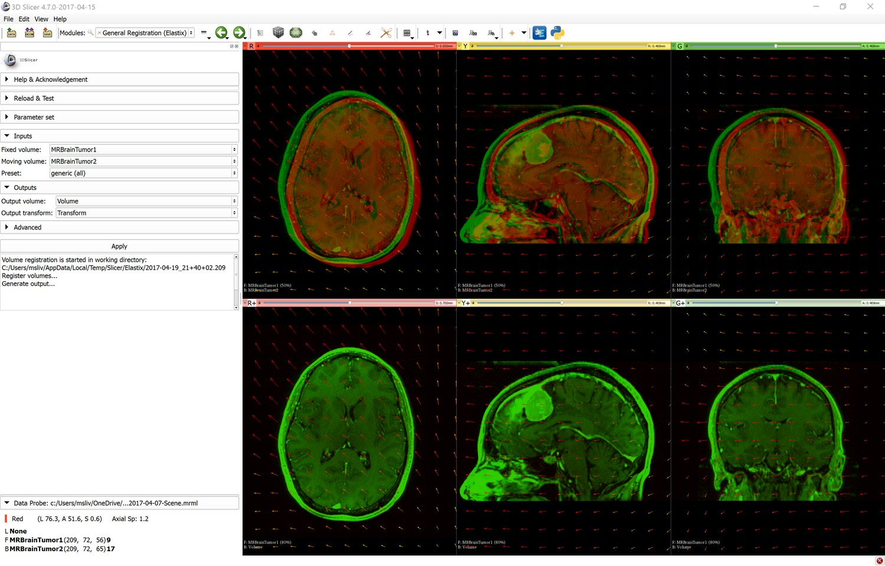

# SlicerElastix
This extension makes available Elastix medical image registration toolkit (http://elastix.isi.uu.nl/) available in Slicer.

## Installation

* Download and install latest stable release or a recent nightly release of 3D Slicer (https://download.slicer.org).
* Start 3D Slicer application, open the Extension Manager (menu: View / Extension manager)
* Install SlicerElastix extension (in Registration category)

## Register two volumes

* Start 3D Slicer
* Load your volumes (for example: switch to SampleData module and load MRBrainTumor1 and MRBrainTumor2 images)
* Switch to General registration (Elastix) module (in Registration category)
* Select Fixed volume (for example: MRBrainTumor1)
* Select Moving volume (this volume will be resampled to match voxels of the Fixed volume; for example: MRBrainTumor2)
* Select Preset: `generic (all)` performs deformable registration; `generic rigid (all)` performs rigid registration
* Select "Create new Volume" for Output volume (this will be the resampled moving volume)
* Select "Create new Transform" if later you want to visualize the displacement field or apply the transform to other nodes (points, surfaces, other volumes)
* Click Apply button and wait a couple of minutes

## Visualize and save results
* To compare Fixed volume with Output volume (registered moving volume): set Fixed volume as Foreground volume in slice viewers and fade between the Output volume and Foreground volume to see how well they are aligned.
* To display displacement field: in Transforms module, select the Output transform and in Display section enable visualization in slice and/or 3D views.
* To apply transforms to other nodes: use Transforms module (or in Data module / Transform hierarchy tab: drag-and-drop nodes under the Output transform).
* To save Output volume or transform, select menu: File / Save.

## Customize registration parameters

* Click `Show database folder` in Advanced section, which will open the tolder that contains all registration preset parameter files
* Edit the parameter set database file (`ElastixParameterSetDatabase.xml`) to edit or add a new preset (each `ParameterSet` element defines one preset)
* To modify parameters of a registration step, edit the corresponding `.txt` parameter file
